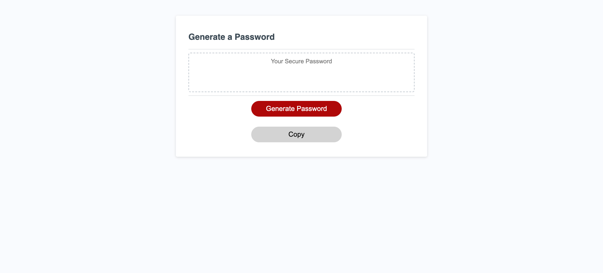

# RANDOM PASSWORD GENERATOR

## Have you ever not been able to think of a secure password? Well, this is the tool for you!
## With this tool you can generate a safe and secure password at any time.

- I created this password generate to help people be more secure online and protect their personal data.

- This tool solves the biggest problem on the internet today, security. With how easy it is
- to have your personal passwords leaked it is recommeneded to change your password frequently.

- During the project, I learned just how useful Javascript can be. I learned that there are limitless
- possibilities of what you could build with the language alone. I expanded my knowledge on the Javascript
- fundamentals such as functions, methods, iteration, and if statements.

## Usage

- You can access the password generator at https://rilaey.github.io/Password-Protector/

